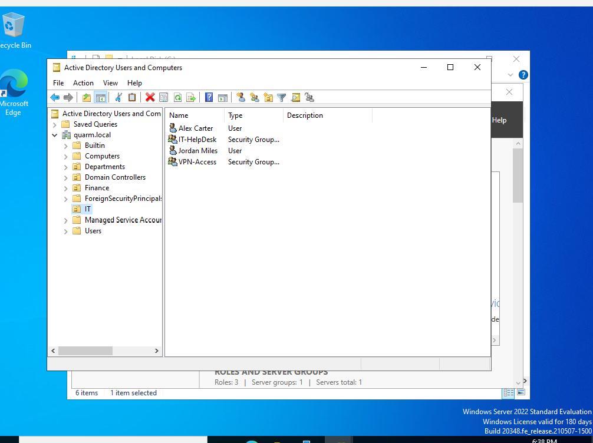
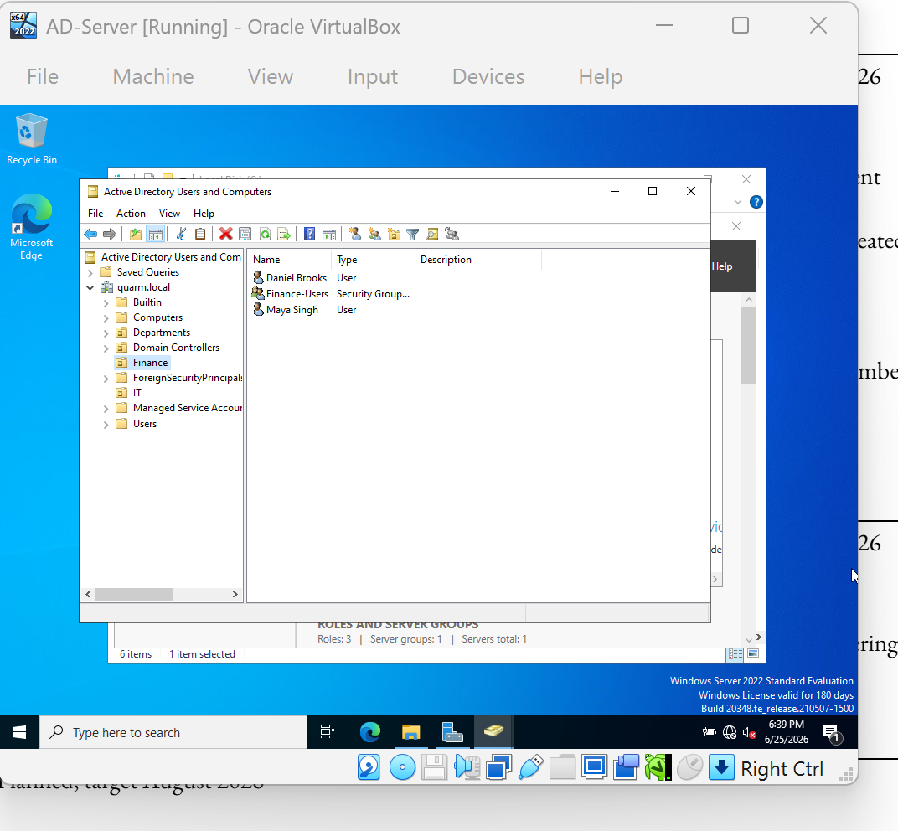
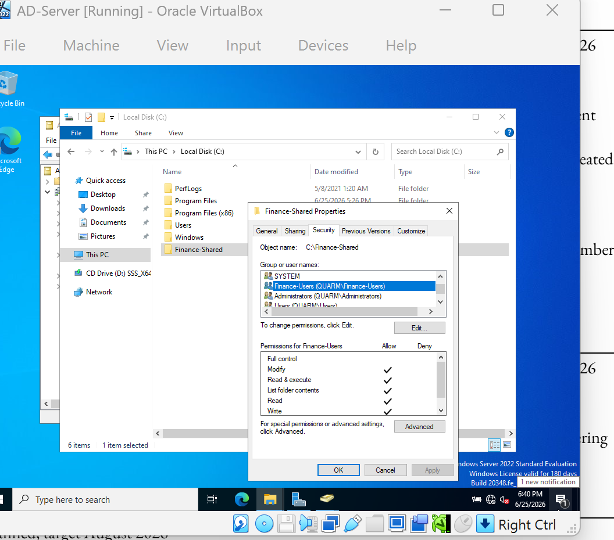

# Active Directory Help Desk Lab

## Objective
Built a local Windows Server Active Directory environment to practice common help desk and user-access administration tasks.

## Environment
- Windows Server 2022
- Active Directory Domain Services
- DNS
- VirtualBox
- Domain: quarm.local
- Domain Controller: DC01

## Completed Tasks

### Ticket 001 - Password Reset
User: m.singh  
Issue: User unable to access account.  
Action: Reset the user password in Active Directory Users and Computers.  
Resolution: Password reset completed and account remained enabled.

### Ticket 002 - Account Disable and Enable
User: d.brooks  
Issue: Account access-control test.  
Action: Disabled and re-enabled the user account in Active Directory.  
Resolution: Account access restored.

### Ticket 003 - VPN Access Group Membership
User: j.miles  
Request: Grant approved VPN access.  
Action: Added user to the VPN-Access security group.  
Resolution: Group membership updated.

### Ticket 004 - Finance Shared Folder Access
Group: Finance-Users  
Request: Provide department access to a shared folder.  
Action: Created the Finance-Shared folder and assigned share and NTFS permissions.  
Resolution: Finance group granted modify access without full control.

## Screenshots

### IT Users and Security Groups

### Finance Users and Security Group

### Finance Shared Folder Permissions

## Skills Demonstrated
Active Directory, Windows Server administration, user provisioning, password resets, account enablement, security groups, access control, shared-folder permissions, DNS fundamentals, and technical documentation.
