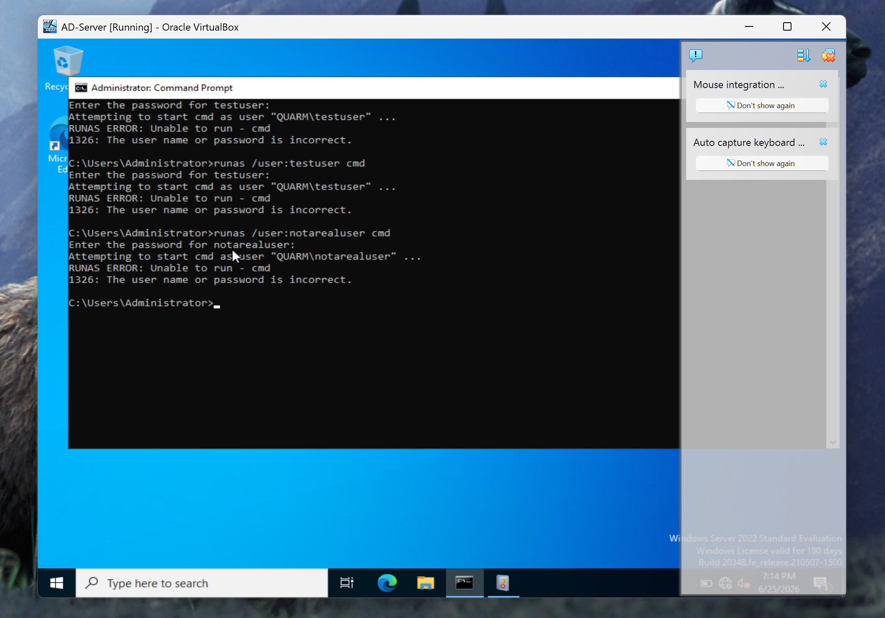
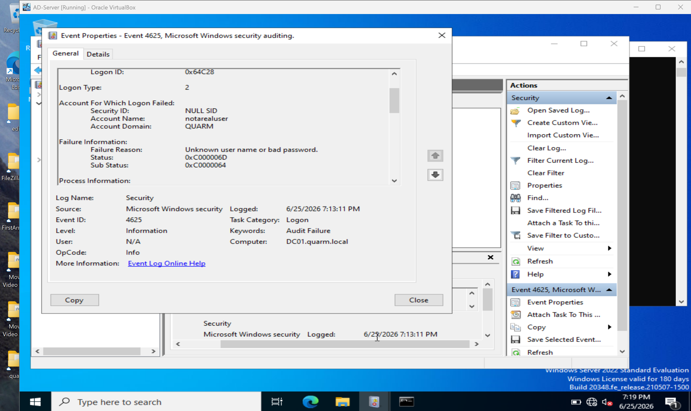
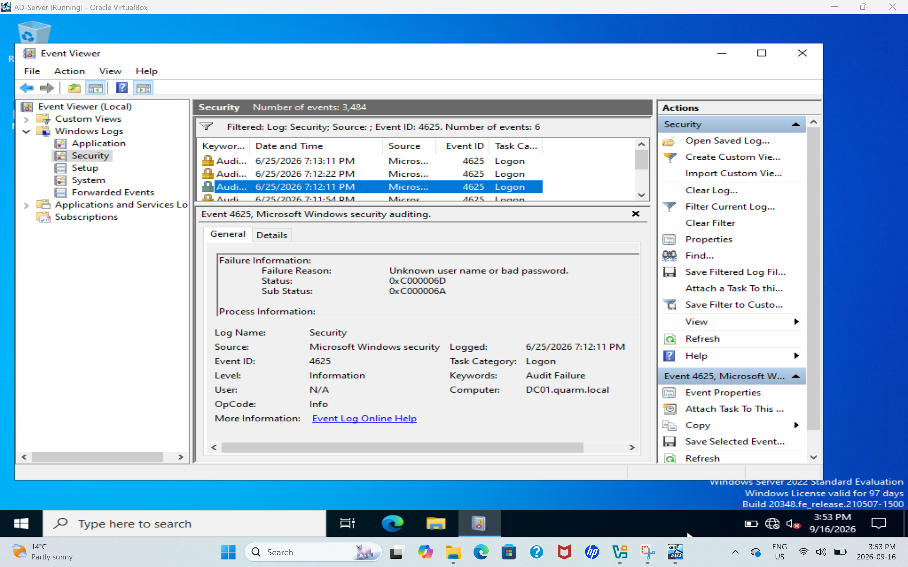
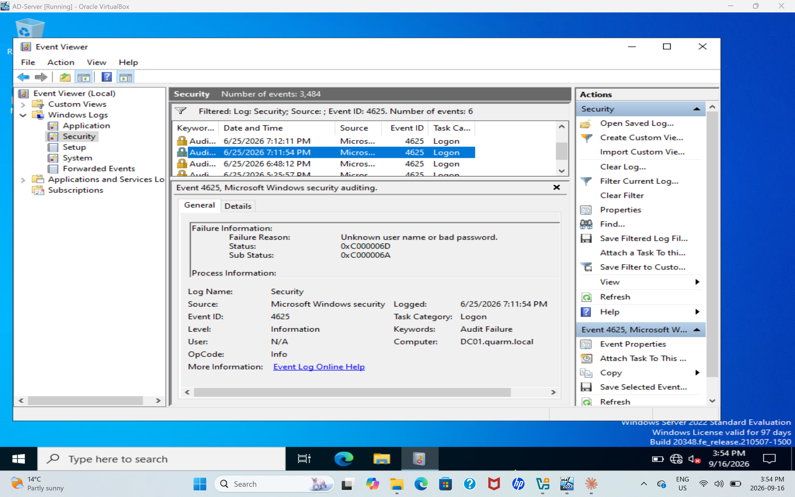
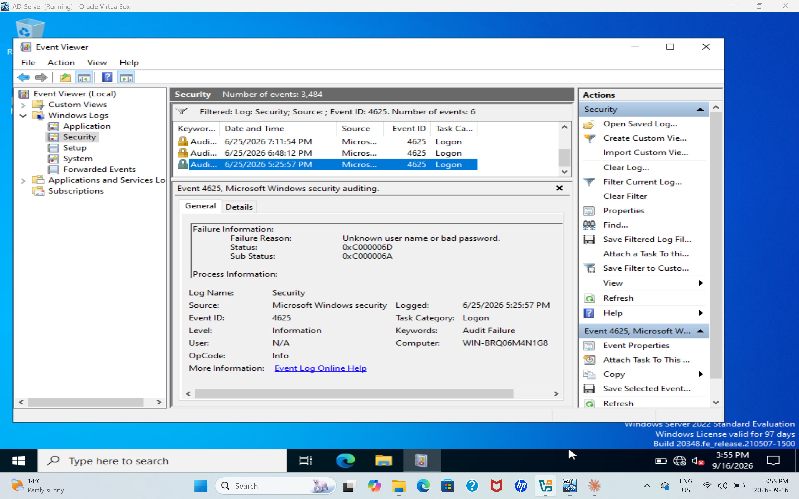
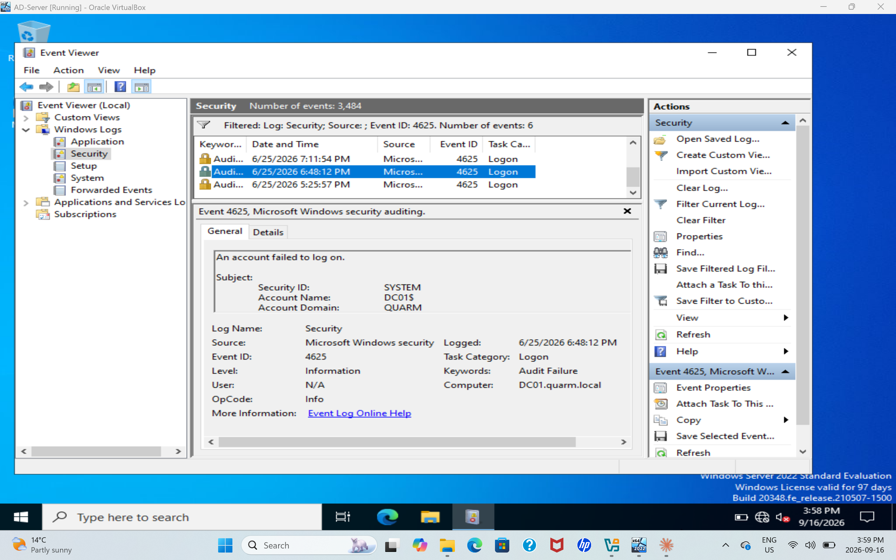

# Windows Failed Login Investigation

## Status
Completed — June 2026.

## Objective
Simulate failed authentication attempts in a local Windows environment and investigate the associated security events.

## Completed Work
- Filtered the Windows Security log for Event ID 4625
- Reviewed five failed-logon events
- Recorded failure details, event metadata, and status codes
- Prepared a basic triage report with recommended response actions

## Planned Evidence
- Windows Event Viewer
- Security Event ID 4625
- Timestamps
- Account names
- Source workstation details

## Planned Deliverables
- Event log screenshots
- Investigation notes
- Timeline of activity
- Short incident-triage report
- Recommended response actions

## Skills Being Developed
Log analysis, authentication monitoring, incident triage, Windows security events, and documentation.

## Screenshots

